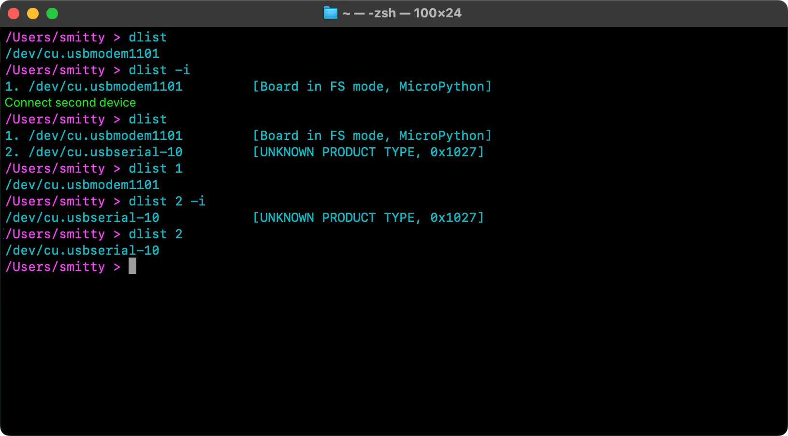

# dlist 0.2.0

#### A Swift-based macOS/Linux CLI utility for listing connected MCU boards and USB-to-Serial adaptors

## Usage



Run `dlist` to get a list of connected MCUs, eg. Raspberry Pi Pico boards.

If only one board is connected, its path within the `/dev/` directory will be provided. For example:

```shell
$ dlist
/dev/cu.PL2303G-USBtoUART10
```

The device file path is issued to `STDOUT` so that it can be passed into other  commands. For example:

```shell
minicom -D $(dlist) -b 9600
```

If multiple MCUs are connected, `dlist` will return a numerical list:

```shell
$ dlist
1. /dev/cu.PL2303G-USBtoUART10
2. /dev/cu.USB-MODEM-001
```

This list is issued to `STDERR`, so it’s printed in a terminal but will typically not be passed to another program. This allows you to select which item you then wish to use. For example:

```shell
$ dlist
1. /dev/cu.PL2303G-USBtoUART10
2. /dev/cu.USB-MODEM-001

$ minicom -D $(dlist 2) -b 115200
```

Including a numerical argument causes `dlist` to issue the specified device (by index in the list) to subsequent commands through `STDOUT`.

**Note** If there is only one MCU connected and you still specify a value but one that is not `1`, this will generate a warning on `STERR` but will still issue the single device's path.

## Options

Including `--info` or `-i` as a `dlist` argument will force it into list mode, however many devices are connected. 

Because the output is intended to be readable by people, it is not suitable for piping into another command. Make sure you don’t include the flag if you’re using `dlist` to pipe the device path.

## macOS Notes

### Ignorable Devices

macOS adds a number of devices to the `/dev/cu.*` set, neither of which can be used for USB-to-serial roles. `dlist` ignores these. However, macOS may also add other devices which cannot be known at compile time. For example, after I have connected my Beats Solo Pro wireless headphones to my Mac, they can appear in `/dev/` as `cu.SmittytoneCans` based on the name I gave them. I can’t know what your wireless headphones are called, so `dlist` now reads a list of ignorable devices from `${HOME}/.config/dlist/ignorables`. Add the extra devices you want `dlist` to ignore there, on a one-device-per-line basis.

## Compiling

### macOS

* Clone this repo.
* `cd /path/to/repo`
* `git submodule update --init --recursive`
* Open the `.xcodeproj` file.
* Set your team under **Signing & Capabilities** for the *dlist* target.
* Select **Build** from the **Product** menu.

### Linux

* [Install Swift](https://www.swift.org/install/linux/)
* Clone this repo.
* `cd /path/to/repo`
* `git submodule update --init --recursive`
* `swift build -c release`

**Note** On the Raspberry Pi 5, the build process and running `dlist` will emit `swift runtime: unable to protect... disabling backtracing` messages. To avoid these, you can add the flag `--static-swift-stdlib`. The *quid pro quo* is that it may start up more slowly and will be a much larger build. An alternative approach is to add `export SWIFT_BACKTRACE='enable=no'` to your shell profile file. This removes the messages, keeps the binary size low, but of course disables Swift's improved crash reporting.

The Linux binary will be located in `.build/aarch64-unknown-linux-gnu/release/`

**Note** The script `bumpbuild.sh`, used in `dlist` development, currently only runs on macOS.

Copyright © 2025, Tony Smith (@smittytone)
