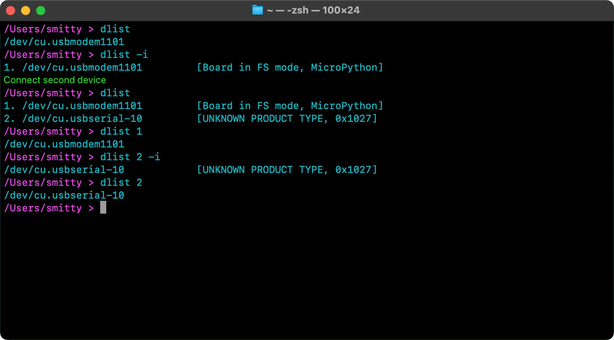

# dlist 0.2.6

A Swift-based macOS/Linux CLI utility for accessing the device paths connected MCU boards and USB-to-Serial adaptors.

## Usage



Run `dlist` to get a list of connected MCUs, eg. Raspberry Pi Pico boards.

If only one board is connected, its path within the `/dev/` directory will be provided. For example:

```shell
$ dlist
/dev/cu.PL2303G-USBtoUART10
```

The device file path is issued to `STDOUT` so that it can be passed into other commands. For example:

```shell
minicom -D $(dlist) -b 9600
```

If multiple MCUs are connected, `dlist` will return a numerical list:


This list is issued to `STDERR`, so it’s printed in a terminal but will typically not be available to be passed to another program. This allows you to select which device you then wish to use. For example:

```shell
$ dlist
┌───┬───────────────────────────────┬────────────────────────────┬───────────────────────────┐
│   │ Device Path                   │ Device Type                │ Vendor                    │
├───┼───────────────────────────────┼────────────────────────────┼───────────────────────────┤
│ 1 │ /dev/cu.PL2303G-USBtoUART1120 │ USB-Serial Controller      │ Prolific Technology Inc.  │
├───┼───────────────────────────────┼────────────────────────────┼───────────────────────────┤
│ 2 │ /dev/cu.usbmodem11101         │ MCP2221 USB-I2C/UART Combo │ Microchip Technology Inc. │
└───┴───────────────────────────────┴────────────────────────────┴───────────────────────────┘

$ minicom -D $(dlist 2) -b 115200
```

Including a numerical argument causes `dlist` to issue the specified device (by index in the list) to subsequent commands through `STDOUT`.

**Note** If there is only one MCU connected and you still specify a value but one that is not `1`, this will generate a warning on `STERR` but will still issue the single device's path.

## Options

Including `--info` or `-i` as a `dlist` argument will force it into list mode, however many devices are connected.

Because the output is intended to be readable by people, it can’t be piped into another command. Make sure you don’t include the flag if you’re using `dlist` to pipe the device path.

## macOS Notes

### Ignorable Devices

macOS adds a number of devices to the `/dev/cu.*` set, none of which can be used for USB-to-serial roles. `dlist` therefore ignores these. However, macOS may also add other devices which cannot be known at compile time. For example, after I have connected my Beats Solo Pro wireless headphones to my Mac, they can appear in `/dev/` as `cu.SmittytoneCans` based on the name I gave them. I can’t know what your wireless headphones (or whatever) are called, so `dlist` now reads a list of ignorable devices from the file `${HOME}/.config/dlist/ignorables`. Add to this file the extra devices you want `dlist` to ignore, on a one-device-per-line basis.

## Compiling

### macOS (Xcode)

**IMPORTANT** A paid Apple Developer Program membership is required to produce a signed release build that can be notarised.

* Clone this repo
* `cd /path/to/repo`
* Open the `.xcodeproj` file
* For signed builds set your team under **Signing & Capabilities** for the *dlist* target
* Select **Archive** from the **Product** menu
* In the **Archives** window, select the new build and click **Distribute Content**
* Follow the sequence, choosing **Custom** and **Build Products**, and save the output to the Desktop
* `sudo cp /path/to/exported/dlist/binary /usr/local/bin/dlist`

### macOS (Swift Compiler)

* Clone this repo
* `cd /path/to/repo`
* `swift build -c release`

The macOS binary will be located in `.build/{architecture}/release/`

### Linux (Swift Compiler)

* Install pre-requisites: `sudo apt update && sudo apt install pkg-config libudev-dev libusb-dev libftdi-dev`
* [Install Swift](https://www.swift.org/install/linux/)
* Clone this repo
* `cd /path/to/repo`
* `swift build -c release`

**Note** On the Raspberry Pi 5, the build process and running `dlist` will emit `swift runtime: unable to protect... disabling backtracing` messages. To avoid these, you can add the flag `--static-swift-stdlib`. The *quid pro quo* is that it may start up more slowly and will be a much larger build. An alternative approach is to add `export SWIFT_BACKTRACE='enable=no'` to your shell profile file. This removes the messages, keeps the binary size low, but of course disables Swift's improved crash reporting.

The Linux binary will be located in `.build/{architecture}/release/`

Copyright © 2026, Tony Smith (@smittytone)
